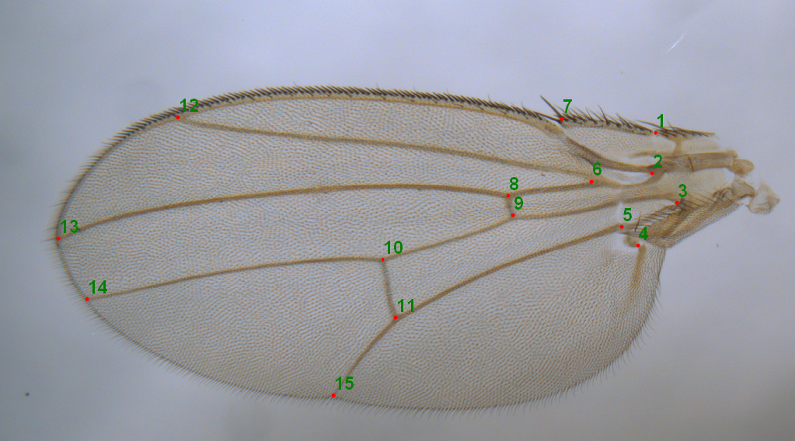
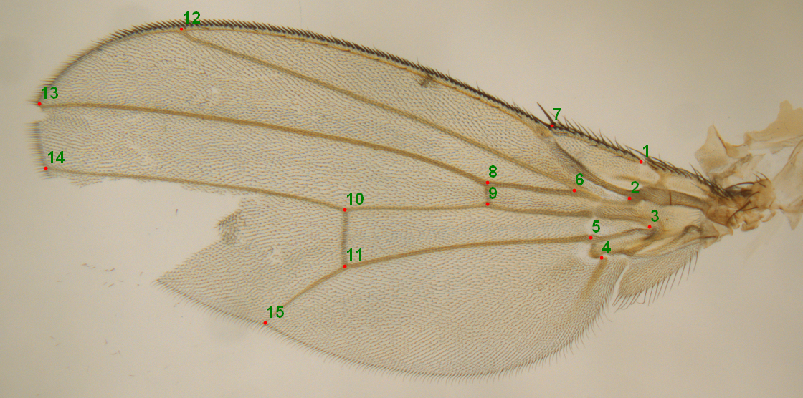
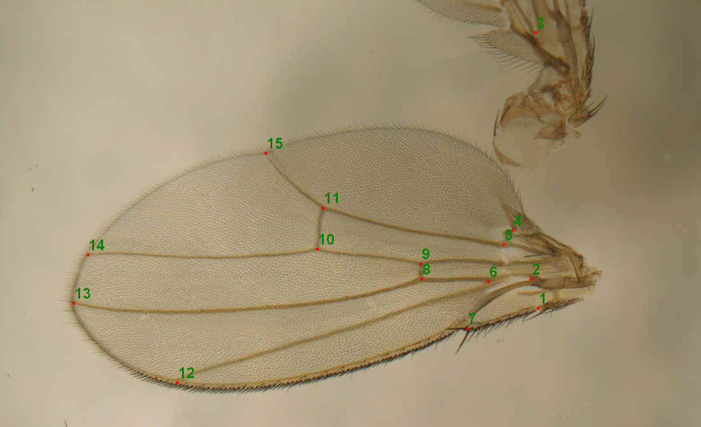

# AIWings

AIWings is a neural network model for automatic placing of landmarks (keypoints) on the wings of *Drosophila melanogaster* for use in geometric morphometrics. 

The dataset for AI Wings was created by Roberto Santoro and Daniel Tendero in the María Domínguez Laboratory at the Instituto de Neurociencias in Alicante, Spain. The dataset contains 3481 images of *Drosophila melanogaster* wings with 15 landmarks per wing. It was created using the software called tpsDig2.

We converted this dataset to a format appropriate for the machine learning library DeepLabCut and trained a neural network on a Windows PC with an NVidia 4090 GPU. It was tested on windows PCs with GPUs and also CPU-only systems.

Using the model: 
- Install DeepLabCut in a separate python environment ([How to install DeepLabCut](https://deeplabcut.github.io/DeepLabCut/docs/installation.html) )
- Download the model (release file)
- Activate the environment you created and run the model in a custom script, as we show in the example script in this repository (mark_landmark.py)

The model will create a .h5 file containing tha landmarks that can be converted to other formats. In the example script, we show how to convert the landmarts to the TPS format, so it could be viewed in the tpsDig2. 

The model correctly recognizes landmarks in the majority of cases, even if the wings or images have noticable defects.

Best results are obtained when there is only one wing per image. Some errors might appear when there are parts of multiple wings in the image. For example:

